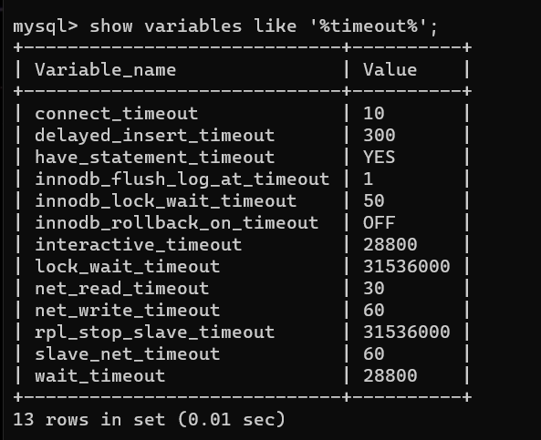

## 여러 가지 테스트해보는 실험실
1. 검색 기능 
2. queryDSL

## 트랜잭션에 대한 연구..
### hikari CP
[connection pool size에 대한 공식 문서](https://github.com/brettwooldridge/HikariCP/wiki/About-Pool-Sizing)

### springBoot
1. @Transactional